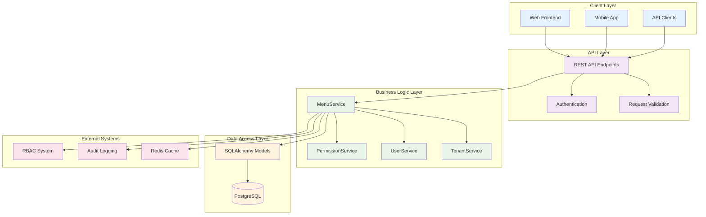
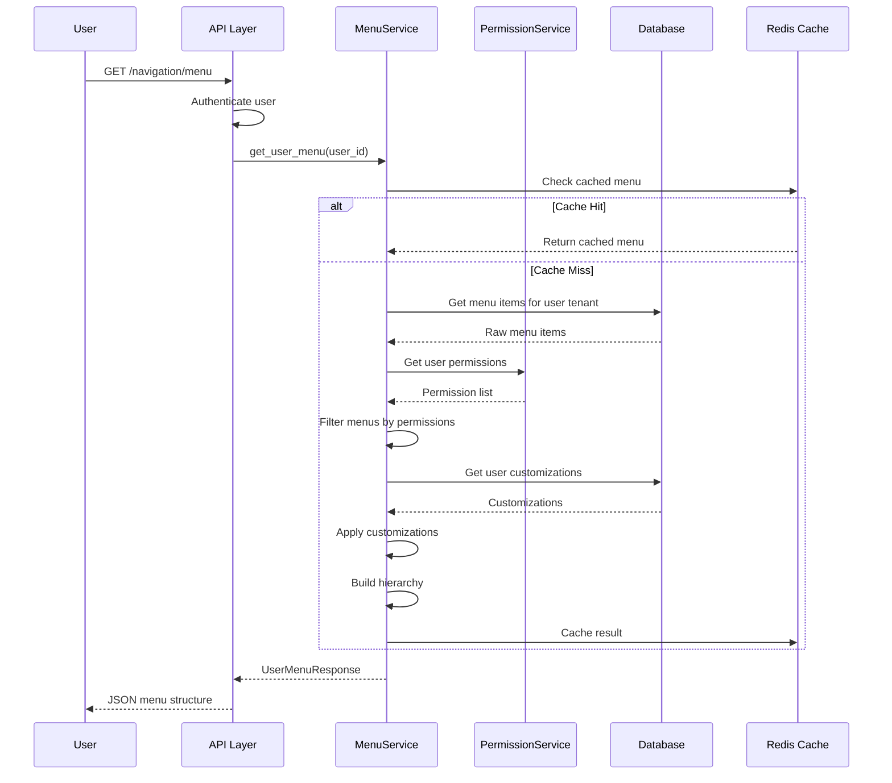
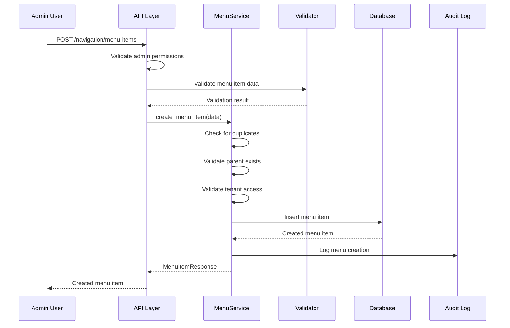
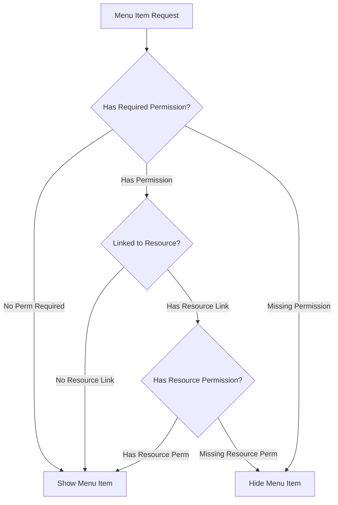
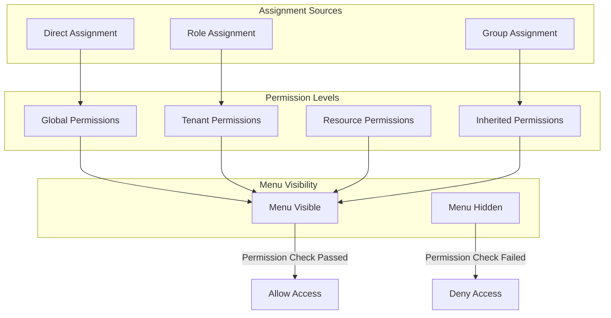
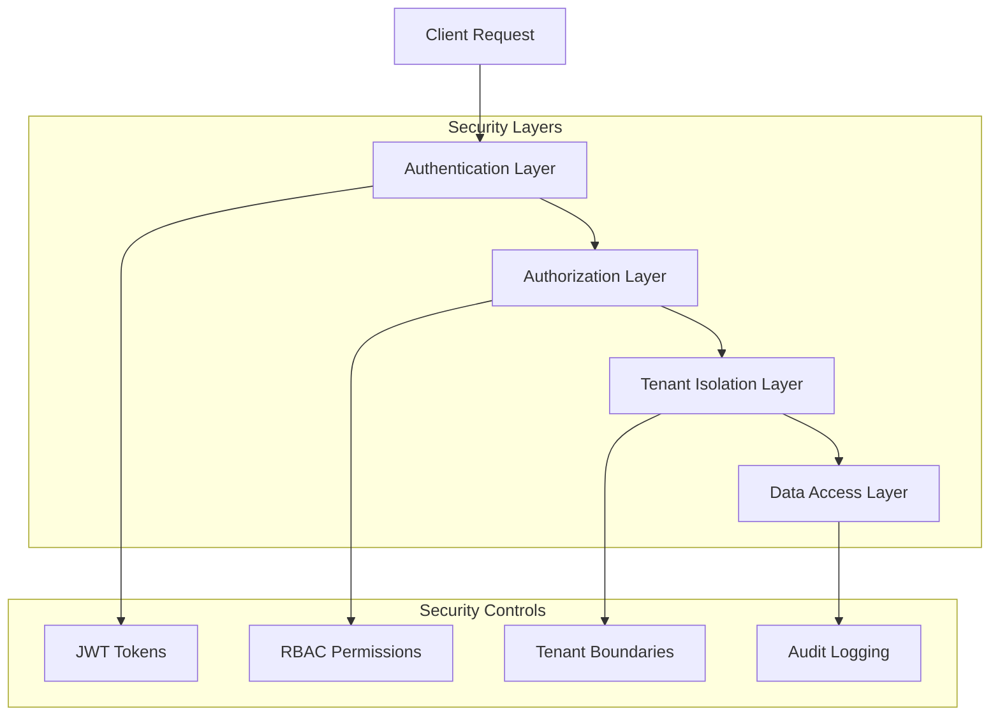
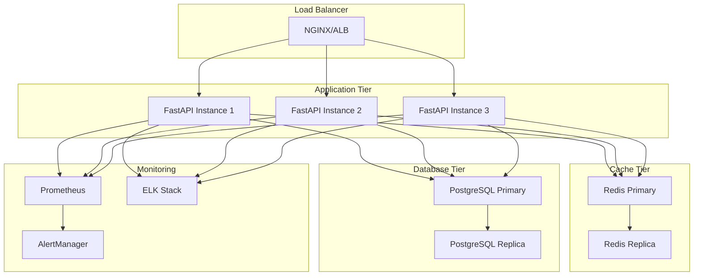

# Menu System Architecture

> Comprehensive architectural overview of the Menu & Navigation system

## System Overview

The Sentinel Menu & Navigation system is designed as a hierarchical, multi-tenant, permission-aware navigation framework that provides personalized menu experiences for users across different logistics industry verticals.

## High-Level Architecture



## Core Components

### 1. MenuService (Business Logic Core)

**Purpose**: Central orchestrator for all menu operations

**Key Responsibilities**:
- Menu CRUD operations
- Hierarchical menu building
- Permission-based filtering
- User customization application
- Statistical reporting

```python
class MenuService:
    """Core service for menu operations."""
    
    async def get_user_menu(self, user_id: UUID) -> UserMenuResponse:
        """Build personalized hierarchical menu for user."""
    
    async def create_menu_item(self, item_data: MenuItemCreate) -> MenuItemResponse:
        """Create new menu item with validation."""
    
    async def customize_user_menu(self, user_id: UUID, customizations: List[Dict]) -> Dict:
        """Apply user-specific menu customizations."""
```

### 2. Data Models (SQLAlchemy ORM)

**MenuItem Model**: Hierarchical menu structure
```python
class MenuItem(BaseModel):
    # Hierarchy
    parent_id: Optional[UUID]
    children: List["MenuItem"]
    
    # Identity
    name: str
    display_name: Optional[str]
    
    # Tenant isolation
    tenant_id: Optional[UUID]
    
    # RBAC integration
    required_permission: Optional[str]
    resource_id: Optional[UUID]
    
    # Display properties
    icon: Optional[str]
    url: Optional[str]
    display_order: int
    is_visible: bool
    menu_metadata: Dict[str, Any]
```

**UserMenuCustomization Model**: User preferences
```python
class UserMenuCustomization(BaseModel):
    user_id: UUID
    menu_item_id: UUID
    is_hidden: bool
    custom_order: Optional[int]
```

### 3. API Layer (FastAPI)

**Endpoints Structure**:
```
/api/v1/navigation/
├── GET    /menu                    # Get user's personalized menu
├── POST   /customize               # Customize user menu
├── GET    /menu-items             # List all menu items (admin)
├── POST   /menu-items             # Create menu item (admin)
├── GET    /menu-items/{id}        # Get menu item details
├── PATCH  /menu-items/{id}        # Update menu item (admin)
├── DELETE /menu-items/{id}        # Delete menu item (admin)
├── GET    /statistics             # Menu statistics
├── GET    /customizations/{id}    # Get user customization
└── DELETE /customizations/{id}    # Reset user customization
```

## Data Flow Architecture

### 1. Menu Retrieval Flow



### 2. Menu Creation Flow



## Multi-Tenancy Architecture

### 1. Tenant Isolation Model

```mermaid
graph TD
    subgraph "System-wide Menus (tenant_id = NULL)"
        SYS1[Dashboard]
        SYS2[Administration]
        SYS3[User Management]
        SYS4[System Reports]
    end

    subgraph "Maritime Tenant (MARITIME)"
        MAR1[Port Operations]
        MAR2[Vessel Management]
        MAR3[Cargo Manifest]
        MAR4[Customs Clearance]
        MAR5[Port Security]
    end

    subgraph "Air Cargo Tenant (AIRCARGO)"
        AIR1[Flight Coordination]
        AIR2[Cargo Handling]
        AIR3[Freight Management]
        AIR4[Security Screening]
    end

    subgraph "Ground Logistics (GROUNDLINK)"
        GRD1[Warehouse Operations]
        GRD2[Fleet Management]
        GRD3[Route Optimization]
        GRD4[Inventory Control]
    end

    subgraph "User Views"
        MAR_USER[Maritime User Sees]
        AIR_USER[Air Cargo User Sees]
        GRD_USER[Ground User Sees]
    end

    SYS1 --> MAR_USER
    SYS1 --> AIR_USER
    SYS1 --> GRD_USER

    MAR1 --> MAR_USER
    MAR2 --> MAR_USER

    AIR1 --> AIR_USER
    AIR2 --> AIR_USER

    GRD1 --> GRD_USER
    GRD2 --> GRD_USER
```



### 2. Menu Resolution Logic

```python
def resolve_user_menus(user: User) -> List[MenuItem]:
    """Resolve menus visible to a user based on tenant membership."""
    
    # 1. Get system-wide menus (available to all users)
    system_menus = get_system_wide_menus()
    
    # 2. Get tenant-specific menus  
    tenant_menus = get_tenant_menus(user.tenant_id) if user.tenant_id else []
    
    # 3. Combine and sort
    all_menus = system_menus + tenant_menus
    
    # 4. Filter by permissions
    accessible_menus = filter_by_permissions(all_menus, user)
    
    return accessible_menus
```

## Permission Integration Architecture

### 1. Permission Check Flow



### 2. Permission Hierarchy



## Scalability & Performance Architecture

### 1. Caching Strategy

```mermaid
graph LR
    subgraph "Cache Layers"
        L1[Application Cache]
        L2[Redis Cache] 
        L3[Database]
    end

    subgraph "Cache Keys"
        USER_MENU[user_menu:{user_id}]
        TENANT_MENU[tenant_menu:{tenant_id}]
        SYSTEM_MENU[system_menu]
        USER_PERMS[user_perms:{user_id}]
    end

    REQUEST[Menu Request] --> L1
    L1 -->|Cache Miss| L2
    L2 -->|Cache Miss| L3
    L3 -->|Data| L2
    L2 -->|Cached Data| L1
    L1 -->|Response| CLIENT[Client]

    USER_MENU --> L2
    TENANT_MENU --> L2
    SYSTEM_MENU --> L2
    USER_PERMS --> L2
```

### 2. Database Optimization

**Indexing Strategy**:
```sql
-- Hierarchy traversal
CREATE INDEX idx_menu_hierarchy ON menu_items(parent_id, display_order);

-- Tenant isolation  
CREATE INDEX idx_menu_tenant ON menu_items(tenant_id, is_visible);

-- Permission filtering
CREATE INDEX idx_menu_permission ON menu_items(required_permission);

-- User customizations
CREATE INDEX idx_user_customizations ON user_menu_customizations(user_id);
```

**Query Optimization**:
- Use CTEs for hierarchical queries
- Batch fetch customizations
- Implement query result caching
- Pre-compute common menu structures

## Security Architecture

### 1. Security Boundaries



### 2. Attack Vector Mitigation

| Attack Vector | Mitigation Strategy |
|---------------|-------------------|
| **Information Disclosure** | Server-side menu filtering |
| **Privilege Escalation** | Strict permission validation |
| **Tenant Data Leakage** | Tenant isolation in queries |
| **Injection Attacks** | Parameterized queries, input validation |
| **Audit Evasion** | Comprehensive audit logging |

## Extension Points

### 1. Custom Menu Providers

```python
class CustomMenuProvider(ABC):
    """Interface for custom menu providers."""
    
    @abstractmethod
    async def get_menus(self, user: User, context: Dict) -> List[MenuItem]:
        """Provide custom menus for user."""
        pass
    
    @abstractmethod
    def get_priority(self) -> int:
        """Provider priority for menu ordering."""
        pass
```

### 2. Menu Event Hooks

```python
class MenuEventHandler:
    """Handle menu lifecycle events."""
    
    async def on_menu_created(self, menu_item: MenuItem, user: User):
        """Handle menu creation event."""
        pass
    
    async def on_menu_customized(self, user_id: UUID, customizations: List[Dict]):
        """Handle menu customization event."""
        pass
```

## Deployment Architecture

### 1. Production Deployment



### 2. Monitoring & Observability

**Key Metrics**:
- Menu request latency
- Cache hit rates
- Permission check performance
- Database query performance
- User customization activity

**Health Checks**:
- Menu service availability
- Database connectivity
- Cache connectivity
- Permission service integration

---

📚 **Next**: [Database Schema](./database-schema.md) - Detailed database design documentation.