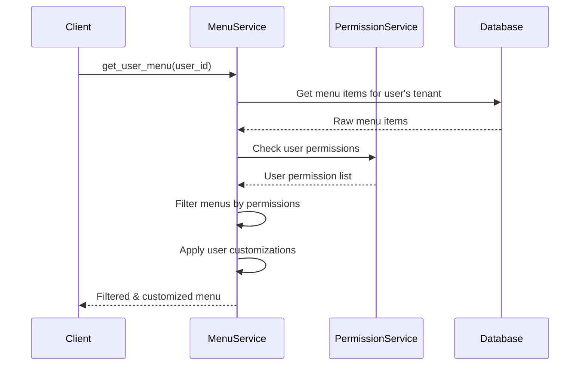
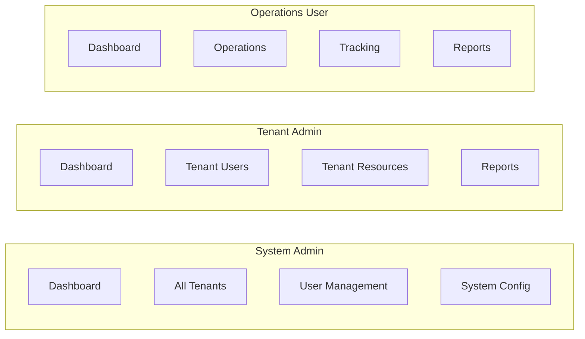

# RBAC Integration Documentation

> How the Menu & Navigation system integrates with Role-Based Access Control (RBAC)

## Overview

The menu system is tightly integrated with Sentinel's RBAC framework, providing automatic permission-based menu visibility and access control. This ensures users only see navigation options they have permission to access.

## Integration Architecture

```mermaid
graph TB
    subgraph "User Context"
        U[User]
        UT[User Tenant]
        UR[User Roles]
        UG[User Groups]
        UP[User Permissions]
    end

    subgraph "Menu System"
        MI[Menu Items]
        MC[Menu Customizations]
        MS[Menu Service]
    end

    subgraph "RBAC System"
        T[Tenants]
        R[Roles]
        G[Groups]
        P[Permissions]
        RS[Resources]
    end

    U --> UT
    U --> UR
    U --> UG
    UR --> UP
    UG --> UP

    MS --> MI
    MS --> MC
    MS --> UP
    MS --> UT

    MI --> T
    MI --> RS
    MI --> P

    classDef userStyle fill:#e1f5fe
    classDef menuStyle fill:#f3e5f5
    classDef rbacStyle fill:#e8f5e8

    class U,UT,UR,UG,UP userStyle
    class MI,MC,MS menuStyle  
    class T,R,G,P,RS rbacStyle
```

## Permission-Based Menu Filtering

### 1. Menu Item Permission Requirements

Menu items can specify required permissions through the `required_permission` field:

```python
# Example menu item with permission requirement
menu_item = MenuItem(
    name="user-management",
    display_name="User Management", 
    required_permission="users:manage",  # Permission required to see this menu
    url="/admin/users"
)
```

### 2. Permission Checking Flow



### 3. Permission Resolution Logic

```python
def can_user_see_menu_item(user: User, menu_item: MenuItem) -> bool:
    """Determine if user can see a menu item based on permissions."""
    
    # 1. Check if menu item requires a permission
    if not menu_item.required_permission:
        return True  # No permission required = visible to all
    
    # 2. Check if user has the required permission
    user_permissions = get_user_permissions(user)
    if menu_item.required_permission in user_permissions:
        return True
        
    # 3. Check resource-based permissions if menu links to a resource
    if menu_item.resource_id:
        return has_resource_permission(user, menu_item.resource_id, menu_item.required_permission)
    
    return False
```

## Tenant-Based Menu Isolation

### 1. System-wide vs Tenant-specific Menus

The menu system supports two types of menu items:

#### System-wide Menus (`tenant_id = NULL`)
- Available to all users across all tenants
- Typically administrative functions
- Examples: Dashboard, System Administration

```sql
-- System-wide menu items
SELECT * FROM menu_items WHERE tenant_id IS NULL;
```

#### Tenant-specific Menus (`tenant_id = specific tenant`)
- Only visible to users of that tenant
- Industry/organization-specific functionality
- Examples: Maritime operations, Air cargo workflows

```sql
-- Tenant-specific menu items for user's tenant
SELECT * FROM menu_items 
WHERE tenant_id = $user_tenant_id OR tenant_id IS NULL;
```

### 2. Multi-Tenant Menu Query

```python
async def get_menus_for_user(user_id: UUID) -> List[MenuItem]:
    """Get all menu items visible to a user based on tenant membership."""
    
    user = await get_user(user_id)
    
    # Query both system-wide and tenant-specific menus
    query = select(MenuItem).where(
        or_(
            MenuItem.tenant_id.is_(None),  # System-wide menus
            MenuItem.tenant_id == user.tenant_id  # User's tenant menus
        )
    )
    
    menu_items = await session.execute(query)
    return menu_items.scalars().all()
```

## Resource-Based Access Control

### 1. Linking Menus to Resources

Menu items can be linked to system resources for fine-grained access control:

```python
# Menu item linked to a specific resource
menu_item = MenuItem(
    name="warehouse-inventory",
    display_name="Inventory Management",
    resource_id=warehouse_resource.id,  # Link to warehouse resource
    required_permission="inventory:read",
    url="/warehouse/inventory"
)
```

### 2. Resource Permission Checking

When a menu item is linked to a resource, permission checking includes:

1. **Global permission**: Does user have the permission globally?
2. **Resource permission**: Does user have the permission on this specific resource?
3. **Inherited permissions**: Through roles and groups

```python
def check_resource_menu_access(user: User, menu_item: MenuItem) -> bool:
    """Check if user can access a resource-linked menu item."""
    
    if not menu_item.resource_id:
        return True  # No resource link = standard permission check
    
    # Check resource-specific permissions
    return has_permission_on_resource(
        user=user,
        resource_id=menu_item.resource_id,
        permission=menu_item.required_permission
    )
```

## Permission Types Used in Menus

### 1. Administrative Permissions

System administration menus use high-level permissions:

```python
ADMIN_MENU_PERMISSIONS = {
    "admin:read": "Access to administration area",
    "users:manage": "User management capabilities", 
    "tenants:manage": "Tenant administration",
    "roles:manage": "Role and permission management",
    "system:configure": "System configuration access"
}
```

### 2. Functional Permissions

Business function menus use specific permissions:

```python
BUSINESS_MENU_PERMISSIONS = {
    "inventory:read": "View inventory data",
    "orders:manage": "Manage customer orders",
    "shipping:track": "Track shipments", 
    "customs:process": "Process customs documentation",
    "security:monitor": "Security monitoring access"
}
```

### 3. Industry-Specific Permissions

Different tenant types have specialized permissions:

```python
MARITIME_PERMISSIONS = {
    "vessels:manage": "Vessel management",
    "berths:assign": "Berth assignment", 
    "customs:clear": "Customs clearance",
    "security:port": "Port security functions"
}

AIRCARGO_PERMISSIONS = {
    "flights:coordinate": "Flight coordination",
    "cargo:handle": "Cargo handling operations",
    "security:screen": "Security screening",
    "ground:services": "Ground service operations"
}
```

## Role-Based Menu Customization

### 1. Role-Specific Menu Structures

Different user roles see different menu structures:



### 2. Dynamic Menu Building

Menus are built dynamically based on user's effective permissions:

```python
async def build_user_menu(user_id: UUID) -> UserMenuResponse:
    """Build personalized menu structure for user."""
    
    # 1. Get user context
    user = await get_user_with_permissions(user_id)
    
    # 2. Get applicable menu items
    menu_items = await get_menus_for_user_tenant(user.tenant_id)
    
    # 3. Filter by permissions
    accessible_menus = []
    for menu in menu_items:
        if can_user_access_menu(user, menu):
            accessible_menus.append(menu)
    
    # 4. Apply user customizations
    customized_menus = await apply_user_customizations(user_id, accessible_menus)
    
    # 5. Build hierarchy
    return build_menu_hierarchy(customized_menus)
```

## Security Considerations

### 1. Permission Validation

All menu operations validate permissions:

```python
@requires_permission("menus:admin")
async def create_menu_item(menu_data: MenuItemCreate) -> MenuItem:
    """Create new menu item - requires admin permissions."""
    pass

@requires_permission("menus:customize")  
async def customize_user_menu(user_id: UUID, customizations: List[Dict]) -> Dict:
    """Customize user menu - requires customization permissions."""
    pass
```

### 2. Information Disclosure Prevention

Menus are filtered server-side to prevent information disclosure:

- **Never send** menu items user cannot access
- **No client-side filtering** of sensitive menu data
- **Permission checks** on every menu request
- **Audit logging** of menu access attempts

### 3. Tenant Isolation

Strict tenant isolation prevents cross-tenant menu access:

```python
def validate_menu_tenant_access(user: User, menu_item: MenuItem) -> bool:
    """Ensure user can only access menus from their tenant."""
    
    # System-wide menus are accessible to all
    if menu_item.tenant_id is None:
        return True
        
    # Tenant-specific menus require matching tenant
    return menu_item.tenant_id == user.tenant_id
```

## Integration Examples

### 1. Frontend Menu Rendering

```typescript
// Frontend receives only accessible menus
interface UserMenu {
  menuItems: MenuItemWithChildren[];
  userId: string;
  customizationsApplied: number;
}

// No client-side permission checking needed
function renderMenu(userMenu: UserMenu) {
  // All items in userMenu are guaranteed to be accessible
  return userMenu.menuItems.map(item => renderMenuItem(item));
}
```

### 2. API Middleware Integration

```python
@app.middleware("http")
async def menu_permission_middleware(request: Request, call_next):
    """Middleware to inject user menu permissions."""
    
    if request.url.path.startswith("/api/v1/navigation"):
        user = get_current_user(request)
        request.state.user_permissions = await get_user_permissions(user.id)
        request.state.user_tenant = user.tenant_id
    
    return await call_next(request)
```

### 3. Real-time Menu Updates

When user permissions change, menus update automatically:

```python
async def on_user_permissions_changed(user_id: UUID):
    """Handle permission changes - refresh user's menu."""
    
    # Invalidate cached menu
    await invalidate_user_menu_cache(user_id)
    
    # Optionally push updated menu to connected clients
    updated_menu = await get_user_menu(user_id)
    await websocket_push_menu_update(user_id, updated_menu)
```

## Troubleshooting Permission Issues

### Common Issues

1. **Menu not visible**: Check if user has required permission
2. **Wrong tenant menus**: Verify user's tenant assignment
3. **Outdated permissions**: Clear permission cache
4. **Customization conflicts**: Check user customization settings

### Debugging Queries

```sql
-- Check user's effective permissions
SELECT p.name, p.description 
FROM permissions p
JOIN user_permissions up ON p.id = up.permission_id
WHERE up.user_id = $user_id;

-- Find why user can't see a menu
SELECT 
  mi.name,
  mi.required_permission,
  mi.tenant_id,
  u.tenant_id as user_tenant,
  CASE 
    WHEN mi.required_permission IS NULL THEN 'No permission required'
    WHEN EXISTS(SELECT 1 FROM user_permissions up JOIN permissions p ON up.permission_id = p.id 
                WHERE up.user_id = u.id AND p.name = mi.required_permission) THEN 'Has permission'
    ELSE 'Missing permission'
  END as permission_status
FROM menu_items mi, users u 
WHERE u.id = $user_id AND mi.id = $menu_item_id;
```

---

📚 **Next**: [API Reference](./api-reference.md) - Detailed API endpoint documentation.