# User Flows & Workflows

> Common user scenarios and workflows for the Menu & Navigation system

## Overview

This document describes the typical user flows and workflows when interacting with the menu system, including both end-user navigation scenarios and administrative menu management tasks.

## Primary User Flows

### 1. User Menu Access Flow

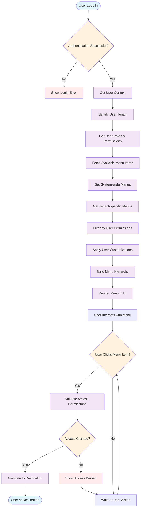

### 2. Menu Customization Flow

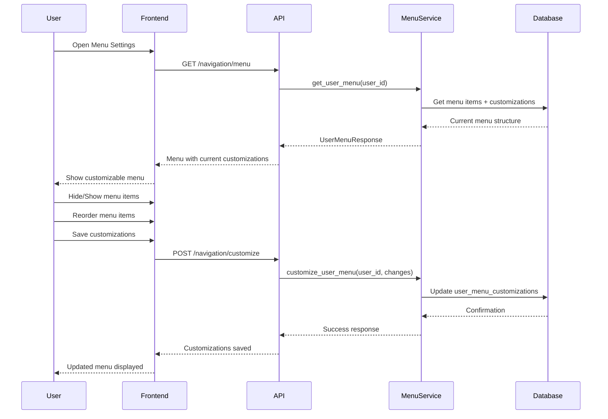

### 3. Permission-Based Menu Filtering

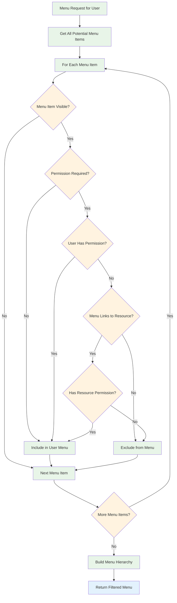

## Administrative Flows

### 1. Menu Item Creation Flow (Admin)

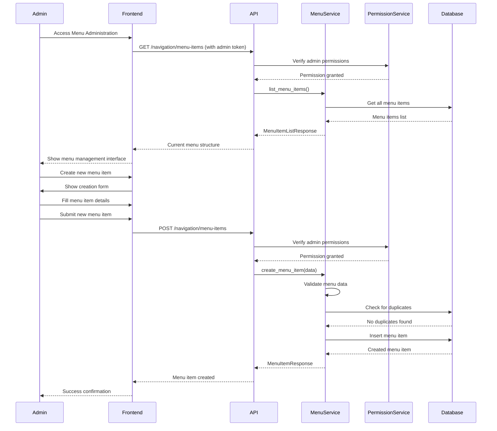

### 2. Hierarchical Menu Organization

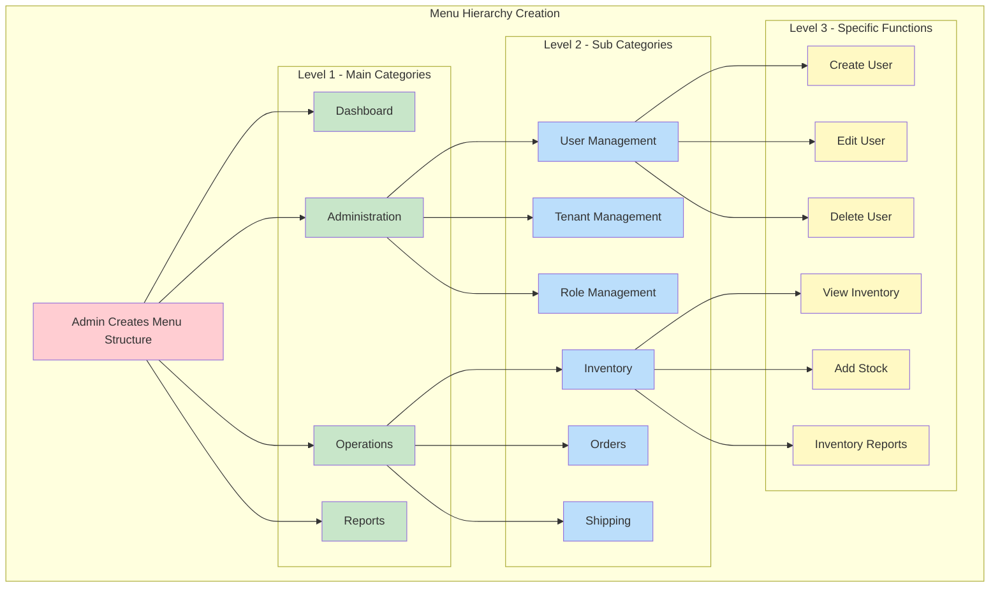

## Industry-Specific Workflows

### 1. Maritime Operations Menu Flow

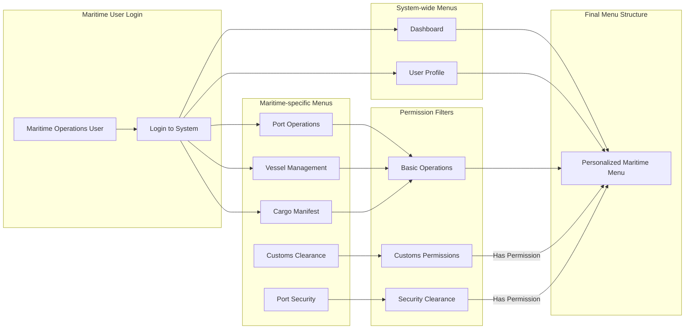

### 2. Air Cargo Operations Menu Flow

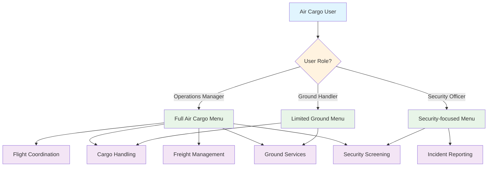

## Error Handling Flows

### 1. Permission Denied Flow

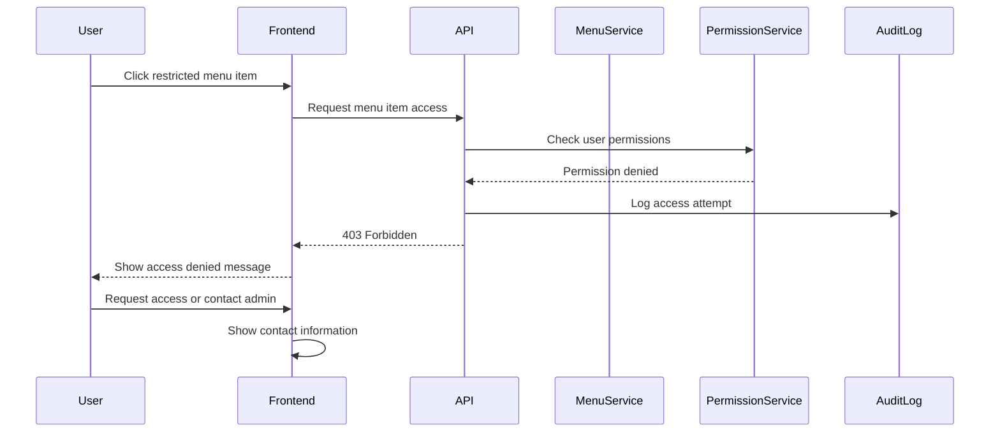

### 2. Menu Loading Error Flow

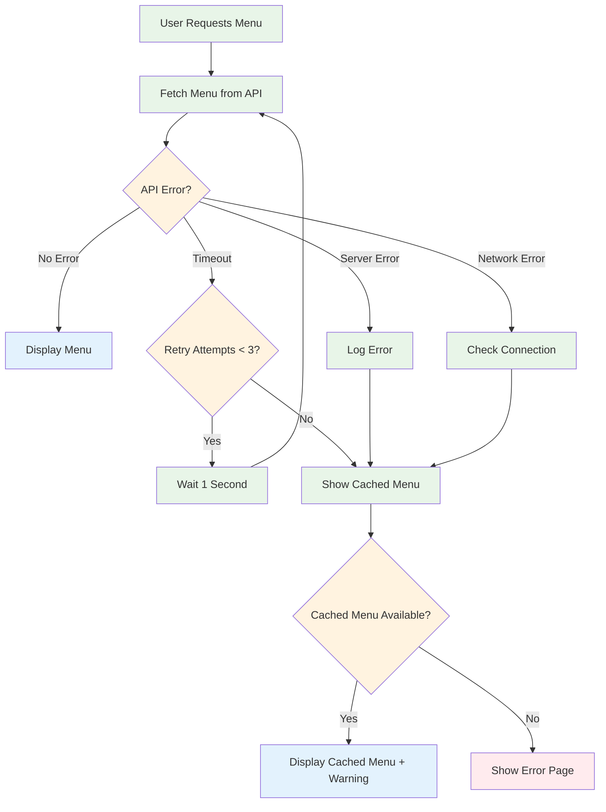

## Performance Optimization Flows

### 1. Menu Caching Strategy

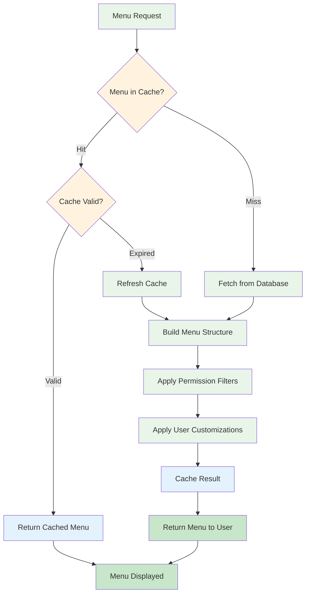

### 2. Batch Menu Operations

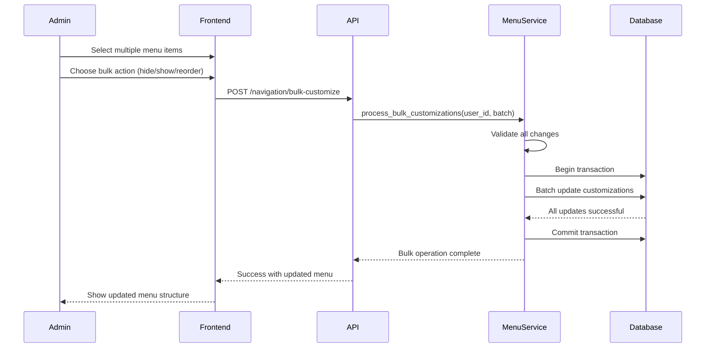

## Integration Workflows

### 1. Real-time Menu Updates

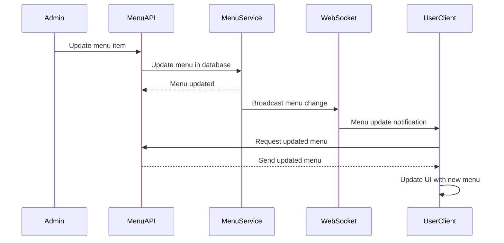

### 2. Permission Change Impact

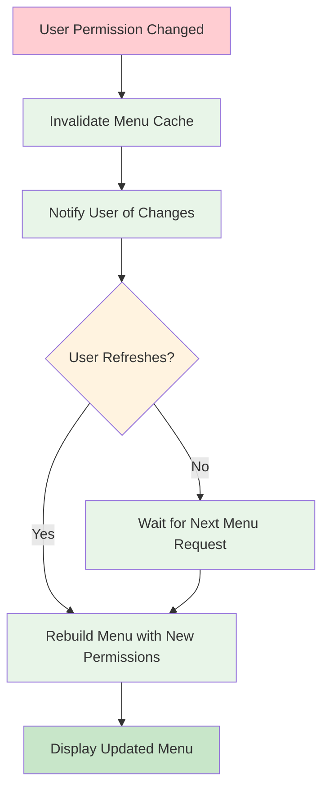

---

📚 **Next**: [Implementation Guide](./implementation.md) - Technical implementation details for developers.